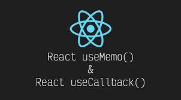

# useCallback은 무엇일까❓



#### `useCallback`리렌더링 간에 함수 정의를 캐시할 수 있는 React Hook이라고 불린다.

```js
//사용법
const cachedFn = useCallback(fn, dependencies);
```

## 참조

#### `useCallback(fn, dependencies)`

```js
import { useCallback } from 'react';

export default function ProductPage({ productId, referrer, theme }) {
  const handleSubmit = useCallback((orderDetails) => {
    post('/product/' + productId + '/buy', {
      referrer,
      orderDetails,
    });
  }, [productId, referrer]);
```

## 매개변수

- ##### `fn`: 캐시하려는 함수 값이며, 모든 인수를 취하고 반환이 가능하다. 또 React는 초기 렌더링 중에 함수를 반환을 한다.

* ##### `dependencies`: 코드 내부에서 참조되는 모든 반응 값 목록이다. <br>반응형 값에는 구성 요소 본체 내에서 직접 선언된 소품, 상태 및 모든 변수와 함수가 포함이 된다.

### 보고

초기 렌더링에서 전달한 함수를 useCallback반환을 한다. (fn)
후속 렌더링 중에 마지막 렌더링에서 이미 저장된 함수를 반환하거나 fn (종속성이 변경되지 않은 경우)
이 fn렌더링 중에 전달한 함수를 반환을 한다.

## 용법

### 구성 요소의 다시 렌더링 건너뛰기

##### (렌더링 성능을 최적화할 때 자식 구성 요소에 전달하는 기능을 캐시해야 하는 경우)

```js
//구성 요소를 다시 렌더링하는 사이에 함수를 캐시하려면 해당 정의를 후크로 래핑하고, useCallback을 사용한다.
import { useCallback } from 'react';

function ProductPage({ productId, referrer, theme }) {
  const handleSubmit = useCallback((orderDetails) => {
    post('/product/' + productId + '/buy', {
      referrer,
      orderDetails,
    });
  }, [productId, referrer]);
  // ...
```

### 2가지를 전달해야 한다.

- ##### 1. 다시 렌더링 사이에 캐시하려는 함수 정의
- ##### 2. 함수 내에서 사용되는 구성 요소 내의 모든 값을 포함하는 종속성 목록입니다 .

      초기 렌더링에서 반환 되는 함수는useCallback 전달한 함수

#### 유용하게 쓰이는 예제

##### `handleSubmit`에서 구성 요소로 함수를 `ProductPage`전달 한다고 가정하자

```js
function ProductPage({ productId, referrer, theme }) {
  // ...
  return (
    <div className={theme}>
      <ShippingForm onSubmit={handleSubmit} />
    </div>
  );

  //theme소품을 토글하면 앱이 잠시 정지 되지만 <ShippingForm />JSX에서 제거하면 빠르게 느껴진다.
  //이는 구성 요소를 최적화할 가치가 있음을 알려준다.
```

#### 결론 : 기본적으로 구성 요소가 다시 렌더링되면 React는 모든 자식을 재귀적으로 다시 렌더링을 한다는 것이 key Point이다.

## 메모화된 콜백에서 상태 업데이트

```js
//handleAddTodo함수는 todos다음 할 일을 계산하기 때문에 종속성으로 지정

function TodoList() {
  const [todos, setTodos] = useState([]);

  const handleAddTodo = useCallback((text) => {
    const newTodo = { id: nextId++, text };
    setTodos([...todos, newTodo]);
  }, [todos]);
  // ...
```

    일반적으로 메모화된 함수가 가능한 한 적은 종속성을 갖기를 원할 것이기에,
    다음 상태를 계산하기 위해서만 일부 상태를 읽는 경우 대신 업데이트 함수를 전달하여 해당 종속성을 제거할 수 있다.\

```js
function TodoList() {
  const [todos, setTodos] = useState([]);

  const handleAddTodo = useCallback((text) => {
    const newTodo = { id: nextId++, text };
    setTodos(todos => [...todos, newTodo]);
  }, []); // ✅ No need for the todos dependency
  // ...
```

## 사용자 지정 후크 최적화

```js
//사용자 지정 Hook을 작성하는 경우 반환되는 모든 함수를 다음으로 래핑하는 것이 좋습니다 useCallback.

function useRouter() {
  const { dispatch } = useContext(RouterStateContext);

  const navigate = useCallback(
    (url) => {
      dispatch({ type: "navigate", url });
    },
    [dispatch]
  );

  const goBack = useCallback(() => {
    dispatch({ type: "back" });
  }, [dispatch]);

  return {
    navigate,
    goBack,
  };
}
```

### 마치며

    처음에도 useCallback이랑 useEffect의 개념을 모르고 사용을 했지만, 지금 이렇게 공부를 해보면서 느낀 결과에도 솔직히
    아직도 헷갈리는 것 같다 약간 이름부터 비슷한 역할을 할 것 같은 느낌이 들기 때문인가..? 라는 생각이 든다.
    이번 공식문서만이 아니라 더 다양한 블로그나 개발자의 문서를 보면서 더 공부하고 싶은 의향이 생겼다.
