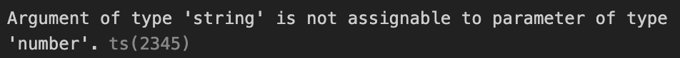
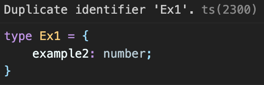

# 왜 TypeScript인가?

## JavaScript

JavaScript는 웹 개발에 주로 사용되는 프로그래밍 언어이다.  
웹 개발에서 JavaScript는 `근육`과 같은 역할을 한다.  
JavaScript가 없는 어플리케이션은 우리가 원하는 퍼포먼스를 낼 수 없다.  
침대에 누워 움직이지 못하는 `식물인간`과 같다.

**JavaScript는 어플리케이션을 보다 동적으로 만들어준다.**

client 자체에서 논리적 작업을 하고 server측과 통신을 가능케한다.

### JavaScript의 장점

- 학습이 쉽다.

  JavaScript는 프로그래밍을 처음 배우는 사람도 쉽게 배울 수 있다.  
   별도의 타입 지정도 필요 없으며 단순한 구조이다.

- 사용이 편리한 내장 메소드가 많다.

  `map`, `filter`, `splice`, `parseInt`, `slice`, `split`, `repeat`등 편리한 메소드가 많다.  
   코딩 테스트를 풀 때에도 도움이 된다.

- 하나의 언어로 client측과 server측 모두 구축할 수 있다.

  Java는 server를 구축하기 위한 대표적인 프로그래밍 언어이다.  
   하지만 client측은 Java로 프로그래밍이 불가능하다.  
   JavaScript는 client와 server 모두 구축할 수 있다.  
   JavaScript라는 언어 하나만 알고 있어도 원하는 어플리케이션을 구현할 수 있다.

- 별도의 컴파일 과정이 없이 즉시 실행이 가능하다.

### JavaScript의 단점

- 단일 상속만 가능하다.

- 변수의 타입 유형을 정의할 수 없다.

- interface로 명시할 수 없다.

- 사용자에게 노출되어있다.

숫자를 덧셈 해주는 계산기 함수를 JavaScript로 구현하려고 한다.

```js
const calculator = (num1, num2) => {
  console.log(num1 + num2);
};

/*1*/ calculator(123, 0);
/*2*/ calculator("123", 0);
```

1에서는 `123`이라는 `number`타입의 결과가 출력된다.  
2에서는 `"1230"`이라는 `string`값이 출력된다.

2에서의 결과값은 우리가 원하는 결과가 아니다.  
JavaScript는 의도하지 않은 타입의 인자가 들어오더라도 걸러내지 않는다.

테스트시에 이러한 문제가 발견되지 않다가 운영시에 발생된다면 타격을 줄 수 있다.

## TypeScript


**TypeScript는 JavaScript와 다르게 변수의 타입을 지정해준다.**  
변수의 타입을 지정해 줌으로서 위와 같은 문제를 줄일 수 있다.

```ts
const calculator = (num1: number, num2: number) => {
  console.log(num1 + num2);
};

/*1*/ calculator(123, 0);
/*2*/ calculator("123", 0); // error
```

1에서는 `123`이라는 `number`타입의 결과가 출력된다.  
2에서는 컴파일 과정에서 오류가 난다.



이렇게 오류로 나타내짐으로서 운영시에 생길 문제를 미리 예방할 수 있다.

### interface

TypeScript에서는 JavaScript에서는 지원하지 않는 interface를 지원한다.  
interface는 상호간에 정해놓은 규칙을 의미한다.  
interface를 이용해서 type을 정의할 수도 있다.

```ts
interface Props {
  num1: number;
  num2: number;
}

const calculator = ({ num1, num2 }: Props) => {
  console.log(num1 + num2);
};
```

위와 같이 interface를 사용하여 type을 정의해주면 공통적으로 사용되는 부분을 미리 정의할 수 있어서 좋다.

### Type

type 키워드를 이용해서도 변수의 타입을 정의할 수 있다.

```ts
type Props = {
  num1: number;
  num2: number;
};

const calculator = ({ num1, num2 }: Props) => {
  console.log(num1 + num2);
};
```

interface와 type은 각각의 장단점이 있는데 아래는 내가 속한 팀의 선배께서 해주신 말씀이다.

> 개인적인 생각이지만 나는 extends 해서 쓰는게 되게 많아서 그런가
> 무조건 interface 로 쓰는 주의임

> 예기치 못한 이슈들이 발생할 수 있어서 확실히 props를 위한 type 선언은 interface가 나은 선택 같습니다

더 찾아보니 interface는 선언적 extends가 가능하지만 type은 불가능하다고 한다.

&darr; 처럼 작성하면 자동적으로 extend가 된다.

```ts
interface Ex1 {
  example1: string;
}

interface Ex1 {
  example2: number;
}
```

&darr; 처럼 작성하면 오류가 생긴다.

```ts
type Ex1 = {
  example1: string;
};

type Ex1 = {
  example2: number;
};
```


<br/>
<br/>
<br/>


mtb 자전거에 로드 자전거에 들어가는 휠을 장착한다면 문제가 생길 것이다.  
나는 내가 조립한 자전거가 주행중에 고장나는 것을 원하지 않는다.  
자전거에 문제가 없는지 주행 전에 꼼꼼히 점검받을 것이다.  
점검 과정에서 미리 문제를 발견한다면 자전거 사고를 줄일 수 있다.

### References

[Amazon - what is JavaScript](https://aws.amazon.com/ko/what-is/javascript/)
