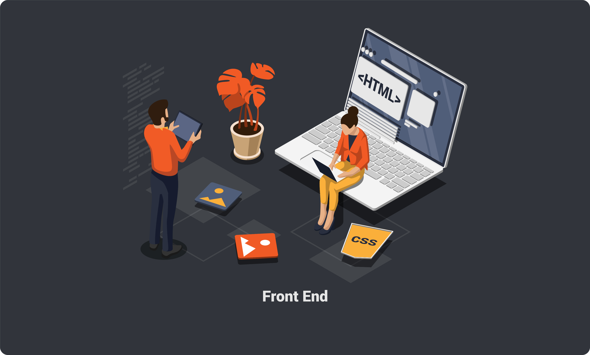

# 개발 팀 역할에 따른 업무

## 1. PM

    IT 프로젝트의 개발부터 출시, 외부의 팀과 커뮤니케이션과 조율 등 프로젝트 전반을 관리하는 업무이다.

- ##### FE, BE는 어떤 일을 왜 하는지 IOS/AOS 개발자가 어떤 차이가 있는지를 알아야 한다.

* ##### 서비스의 개발 일정을 확인하고 상황보고하고 이슈를 발견하여 해결하거나 보고하는 일을 한다.
* ##### 팀 외부 관계자와 커뮤니케이션 담당을 하고 회의를 주관하며 서류작업을 중점으로 둔다.

## 2. PL

    PM을 도와서 프로젝트를 리드하는 사람을 뜻한다.

- ##### 현업(고객)과 대화를 통해 정확한 요구사항을 기술적으로 분석
- ##### 업무에 대해 정리를 하고, 무엇을 개발할지 어떻게할지 또 고객 만족과 개발자의 만족하는 방법을 찾음
- ##### 본인의 기술적인 부분에 대해 클라이언트와 커뮤니케이션을 하며 업무 분배, 일정관리 및 조율 매니징 역할

## 3. 개발자

    일명 프로그래머라고 불리기도 하는 개발자는 컴퓨터 프로그램의 논리나 알고리즘을 설계하고 프로그램을
    작성하고 테스트하는 사람을 이야기한다.

 

### 3-1. 리드개발자

    리드 개발자는 시니어 개발자의 역할을 할 수 있고, 전반적인 설계 지침을 제공하고 제품 개발 초기 단계 투입

#### 리드 개발자의 업무

- ##### 제품개발 및 일정 계획 지원을 한다.
- ##### 마케팅 또는 영업팀에 피드백을 제공을 한다.

#### 리드 개발자가 되기 위해 갖추어야 할 기술력

- ##### 좋은 커뮤니케이션 기술
- ##### 제품에 대한 충분한 이해
- ##### 관리, 제품 개발, 마케팅 등과 같은 다른 분야의 전반적인 이해
- ##### 기능, 시스템 설계를 위한 기술 사양 계쵝 및 문서화
- ##### 애플리케이션의 설계, 개발, 코딩, 테스트 및 디버깅을 개발팀에 지시

### 3-2. 시니어 개발자

    시니어 개발자는 리드 개발자와 다르게 코드에 관한 모든것에 대해 더 많은 지식을 가지고 있다.
    리드 개발자는 일반적으로 코드 측면의 최종 판단자 역할을 하고
    시니어 개발자의 의무 중 일부는 후배 구성원들을 멘토링하는 역할? 이라고 할 수 있을 것 같다.

#### 시니어 개발자가 갖춰야할 4가지 요소

- ##### 기술적 리딩 : 후임 개발자가 기술을 스스로 알 수 있도록 인사이트 제공 (review)
- ##### 업무적 리딩 : 작게는 프레임워크, 라이브러리 선택, 크게는 아키텍쳐 진영을 존재하고 선택을 맡김
- ##### 생산성 우위 : 요구사항을 빠르게 만드는 것에 그치는 것이 아닌 품질을 보장하는 구현체 생성
- ##### 난제의 해결 : 어려운 제품의 기능 레퍼런스를 체계적으로, 까다로운 요구사항의 오픈소스를 찾아 커스터마이징
- ##### 더 기능적인 것들 : 작성한 코드 유지보수, 확장성, 코드의 대한 생각, 좋은 질문습관, 올바른 조치 질문 등..

### 3-3. 주니어 개발자

    주니어 개발자는 디자인의 패턴, 아키텍처, 테스트 자동화, 성능, 봉안 등을 아는 것은 시니어 개발자와의
    지식 격차를 좁힐 수 있는 좋은 방법이다.

    주니어 개발자는 많은 경험이 없다보니 코딩이 익숙하지 않고, 멋진 코드를 작성하기 힘들다. 따라서
    기발한 코드 한 줄과 복잡한 추상화로 주니어 개발자로 인식이 가능하다.
    방법으로 비용을 희생하면서 코드에 집중하며 아키텍처 디자인을 하지 않고, 필요한 리소스를 제공받거나
    올바른 방향으로 크게 밀어줘야 한다.

## 4. 기획자

    프로젝트 구현의 시작 (화면 UI 설계서) 이기에 가장 중심에 있다.

- ##### 클라이언트를 포함하여 PM/디자이너/퍼블리셔/개발자 중간에서 상호간 커뮤니케이션의 주체
- ##### 클라이언트의 요구사항을 디자인, 퍼블리싱하고 프로그래밍을 하는데 필요한 문서화 업무와 의사결정

## 5. 디자이너

    웹사이트의 다양한 그래픽 자산을 제작하고 관리하며 유지보수하는 일을 한다.
    직종 이름이 웹 + 디자이너이기 때문에 웹에 들어가는 거라면 웹디자이너의 영역이다.
    대표적으로 UI와 UX 디자이너가 존재한다.

### UI

- ##### 유저인터페이스, UI 를 디자인하는 사람이다.
- ##### 사용자가 상호작용 할 수 있는 모든 인터페이스 (브라우저 뒤로가기, 북마크, 설정 아이콘 등 ..)

### UX

- ##### UX는 디자인의 영역보다는 기획의 영역에 조금 더 가깝다고 보면 좋다
- ##### UX 디자이너는 사용자가 웹 사이트, 디지털 프로덕틀 사용하면서 불편함, 불쾌함을 느끼지 않도록 사용자의 여정을 설계한다는 뜻이 강하다.

## 6. 퍼블리셔

    퍼블리싱을 주로 하는 사람이다

- ##### 웹 사이트를 제작할 때, 웹 디자이너가 디자인 한 것을 웹 표준성과 접근성이 부합하도록 재정리
- ##### 퍼블리싱을 목표로 웹 디자인 작업과 코딩으로 웹 사이트를 제작하고 편집하는 일을 함
- ##### FE와 구분 짓기 위해 사용이 되고, 퍼블리셔는 HTML과 CSS 중심의 업무를 담당 + JS (도입)

## 7. 프론트엔드(FE)개발자

    프론트엔드 개발자는 웹사이트, ‘웹’을 개발하는 웹 개발 영역 중 사용자가 눈으로 보는 영역을 구축하고,
    기능을 구현하는 개발자이다. 눈으로 보는 영역이라 함은 버튼, 입력창, 페이지 내의 애니메이션,
    즉 UI(User Interface)를 의미한다.

- ### 프론트엔드 개발자과 퍼블리셔의 다른점은 무엇일까?

- ##### 1. 더 동적인 화면을 구사한다. (ID, PW 유효성 검사 등)
- ##### 2. 실제 작동 가능한 웹페이지를 구현 (API를 웹페이지에 적용하여 백엔드와 연동)
- ##### 3. 크로스 브라우징, 웹 페이지 호환성, 페이지 개선 (전반에 대해 관리하고 유지 보수)

## 마치며

    나는 지금 프론트엔드 개발자를 꿈꾸고 있는 18살 학생이다. 아직 나한테도 부족한 점이 많지만
    실제로 실무로 나가 적응하기까지의? 시간이 약 1년 정도 남아있기 때문에 이러한 주제를 찾아보는 것이
    뜻깊고 재밌었다. 실무에는 이 보다 더 많은 직무가 있을 수도 있고 없을 수도 있지만 대표적인 기업들의
    개발 팀 역할에 따른 업무를 알아보았다.
